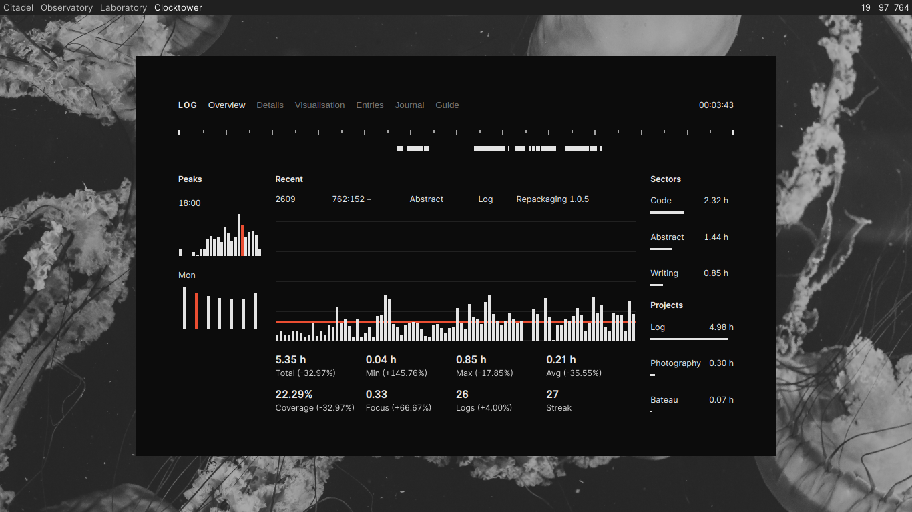

**Log** changelog

### 1.0.5 - J0818

### +
- Added a changelog lol
- Added alternative stat display modes (e.g. 1:30 instead of 1.50)
  - `stat {human|decimal}` - Set the stat display mode
- Added the Average Indicator &mdash; a visual indicator of the average daily log hours
- Added Peak Time chart labels
- Added disappearing scrollbars

### *
- Improved and polished UI layout
- Simplified some commands:
  - `bg {colour}` - Sets the background colour
  - `fg {colour}` - Sets the foreground colour
  - `accent {colour}` - Sets the accent colour
  - `colourmode {sector|project|none}` - Sets the colour mode
  - `cc {sector|project} "Name" "{colour}"` - Set a sector's or project's colour code
  - `view {x}` - Sets the number of days' worth of data to display on charts
  - `calendar {desamber|monocal|gregorian}` - Sets the calendar format
  - `time {12|24|decimal}` - Sets the time format
- Redesigned the Journal
- Clicking on an entry's ID in the Entries table summons an entry editing modal
- Deleting entries now summons a confirmation modal
- Updated the Guide
- The import function now rejects data files containing errors

### -
- Removed forecast stats (for now)

---

If you have any comments, questions, or concerns, don't hesitate to contact me.

Josh Avanier

 
